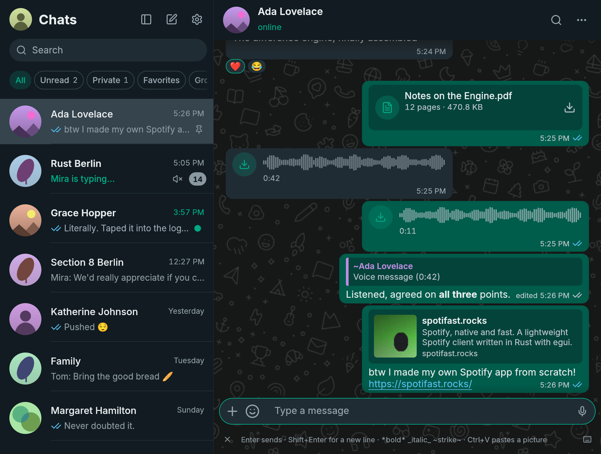
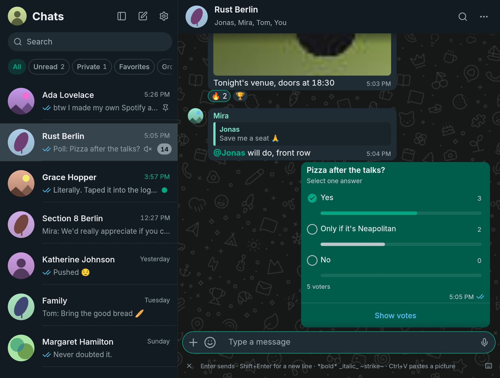
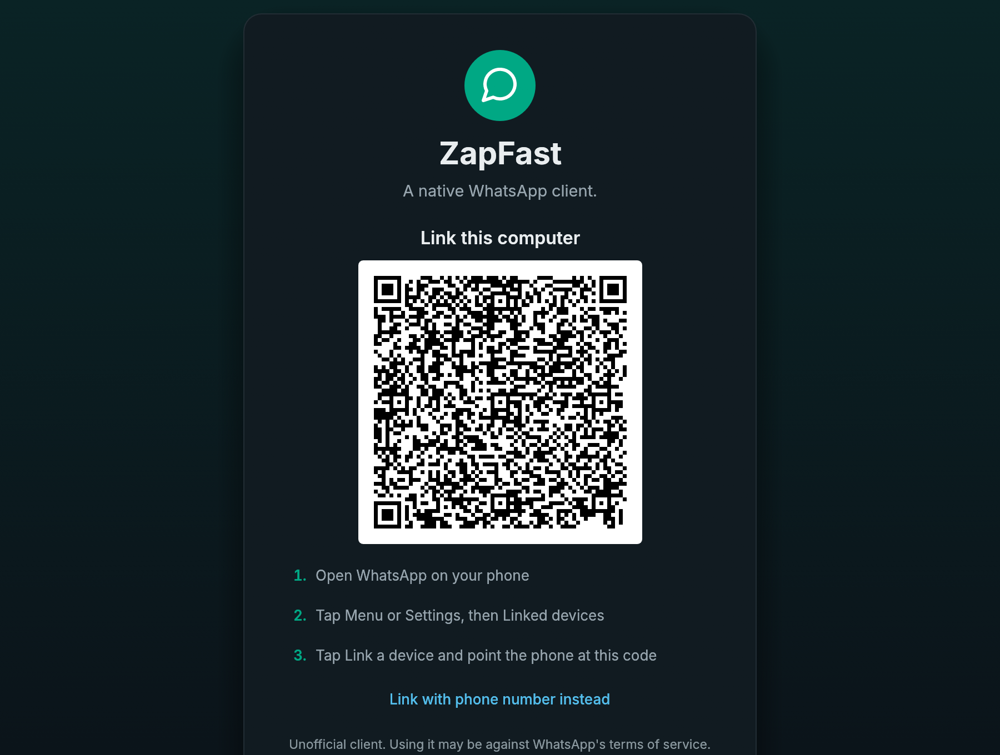
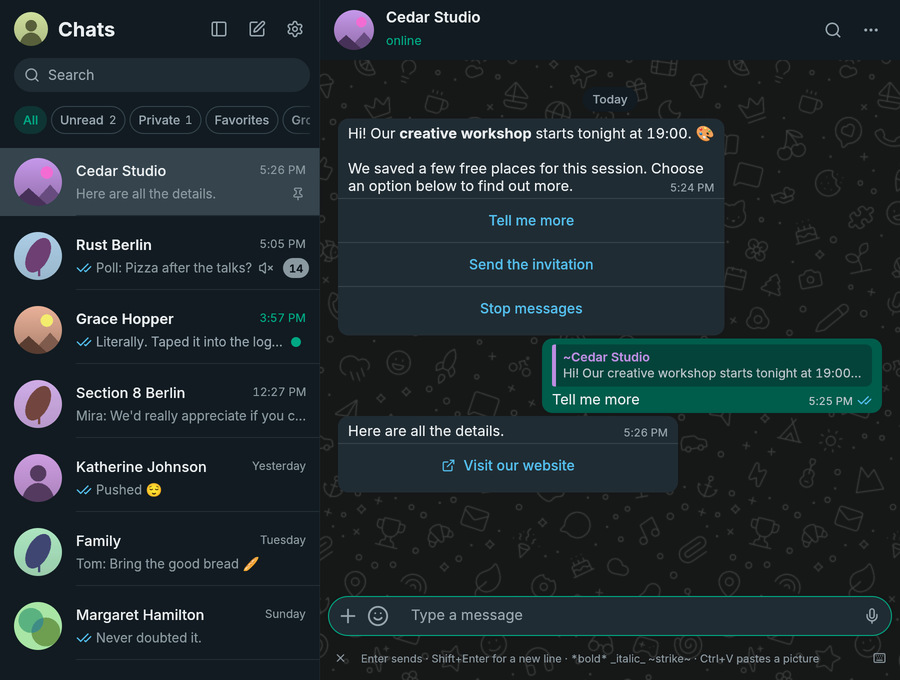
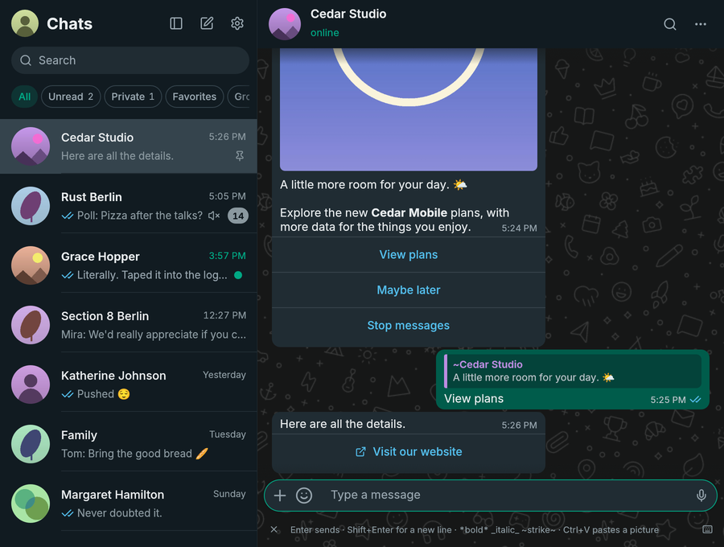
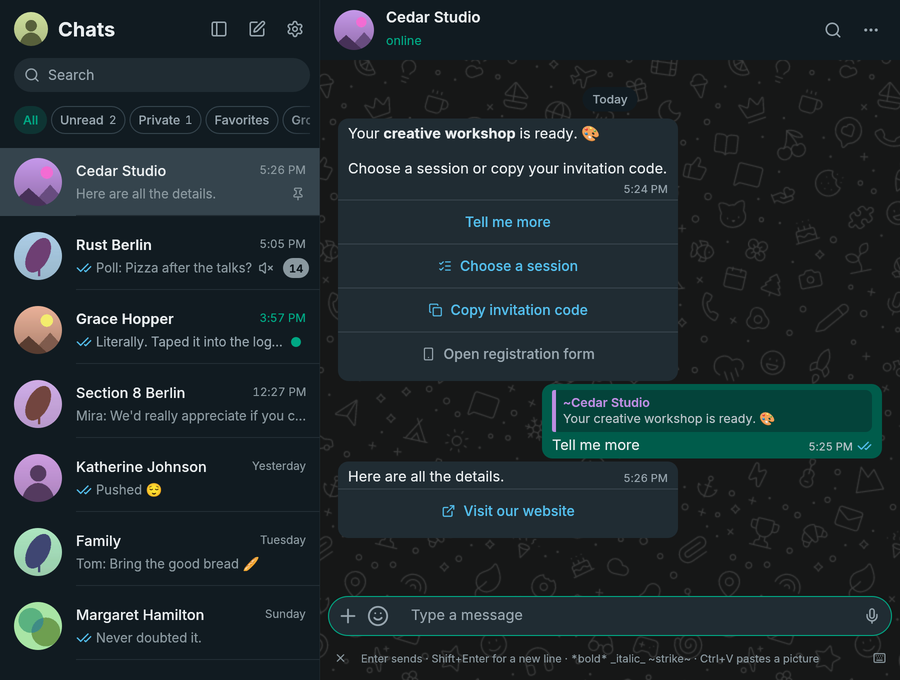
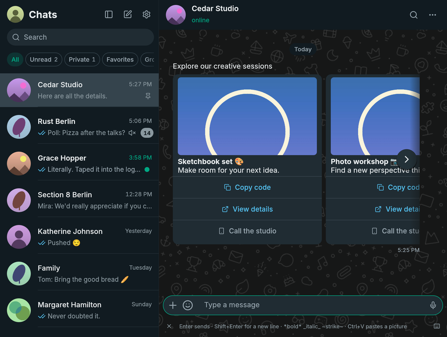
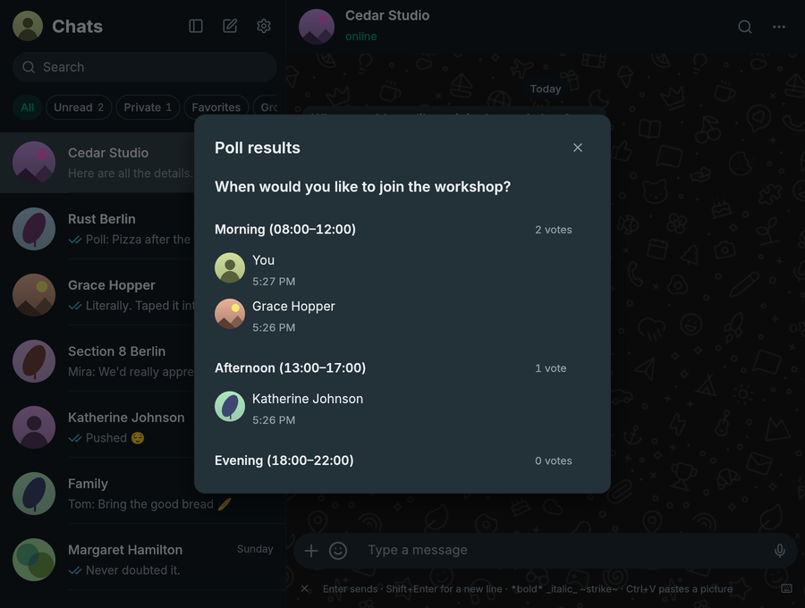

# ZapFast

**WhatsApp, native and fast.** ZapFast is a WhatsApp client written in Rust
with [egui](https://github.com/emilk/egui). It uses
[whatsapp-rust](https://github.com/oxidezap/whatsapp-rust) for the WhatsApp Web
protocol. It runs on Linux, macOS, and Windows, links to your phone as a
companion device, and has no browser engine. In our Linux test, it opens in
under a second and uses about 200 MB of idle RAM, compared with 1.13 GB for
WhatsApp Web and its Chromium processes. [See the measurements](https://zapfast.rocks/benchmarks/).

ZapFast is a sibling of [Spotifast](https://spotifast.rocks),
with the same native UI for a different service.

<picture>
  <source media="(prefers-color-scheme: light)" srcset="docs/screenshot-light.png">
  
</picture>

See **[zapfast.rocks](https://zapfast.rocks)** for downloads and guides.

<picture>
  <source media="(prefers-color-scheme: light)" srcset="docs/screenshot-group-light.png">
  
</picture>

<picture>
  <source media="(prefers-color-scheme: light)" srcset="docs/screenshot-link-light.png">
  
</picture>

## What it does

- **Links to your phone.** Scan a QR code or link with your phone number.
  Recent history is copied to this computer after linking and stored here.
- **Chats.** See pinned, unread, muted, and archived chats, typing indicators,
  and message status. Search chats, saved messages, and contacts. The
  **Search** icon in a chat's header (or **Ctrl+F**) opens a pane beside the
  chat, as in WhatsApp Desktop, listing its matches newest first with the time
  and the line that matched. The calendar narrows them to one day, or lists
  that day's messages when the field is empty. Clicking a result, or reaching
  it with the arrow keys and pressing Enter, brings it into view with a brief
  flash; Escape closes the calendar, then the pane. The pane can be dragged
  wider, and in a narrow window it lies over the conversation instead of
  squeezing it. The newest 80 matches are listed, and the pane says when there
  are more. Right-click a group or a followed channel and choose **Leave group**
  or **Leave channel** to leave it, with the option to archive it in the same
  step; the local history stays on this computer and the chat keeps its
  messages.
  Filter the list to unread, private (one-to-one), favorites, or group chats
  with the chips under the search bar; a chip with unread chats shows how many
  it has. Right-click a chat and choose **Add to favorites** to mark it.
  Favorites sync with your phone both ways, and the **Favorites** chip lists
  them in the phone's order below any pinned chats. A chat added here goes to
  the end of the list; channels cannot be favorites.
  Followed channels have their own **Channels** chip and stay out of the other
  filters; right-click it to mute or unmute every channel at once. **Archived**
  opens the archived chats. Right-click a chat and choose **Mark as unread**
  to put an empty dot on it, as on the phone; the mark syncs with your phone
  both ways, and opening the chat or a new message clears it. Opening a chat with
  unread messages scrolls to an "unread messages" divider above the first one.
  Pinned chats stay in pin order (most recently pinned first), regardless of
  new messages. Like on the phone, you can pin up to three chats. Chat and contact name searches ignore accents, so `Angel`
  finds `Ángel`.
  The filters stay on one row and scroll horizontally in narrow sidebars.
  Unnamed groups use a shared participant summary for their title and subtitle;
  repeated first names appear as `Andrea ×3`, with your own entry shown as `You`.
  Incomplete group metadata preserves known names and retries with backoff;
  an empty cached subject remains eligible for recovery.
  Typing indicators show other participants, excluding your own linked devices.
  Newsletter channels are read-only; publishing channel posts is not supported.
- **Account privacy.** Settings, Privacy shows who can see your last seen,
  online status, profile photo, and About, who can add you to groups, your
  account read receipts, and whether unknown callers are silenced, and
  changes them on your phone, so a change applies on every linked device. A
  category set to **My contacts except** shows as such; the people it excludes
  are chosen on the phone. The values are read when ZapFast connects and when
  Settings opens; without a connection they cannot be changed.
- **Read state across devices.** Reading a chat syncs its unread badge with
  your phone and other linked devices, including when read receipts are off.
  Replies from another device clear preceding unread messages. The read-receipt
  toggle also controls voice-message played receipts; account privacy is checked
  before sending receipts in direct chats. A hidden window does not read messages.
- **Conversations.** See replies, reactions, edits, deleted messages, read
  receipts, sender names, and group pictures. Older messages load as you
  scroll up, first from the local archive and then from your phone.
  Group messages show two gray checks after every recipient has received
  them, and blue checks after every recipient has read them. The recipient
  list and individual receipts are saved locally; later membership changes
  do not change that list. If the original recipients are unknown, ZapFast
  waits for the phone's aggregate status instead of guessing from one reader.
  A message that could not be sent says "Not sent" beside its time. ZapFast
  does not retry it; send it again yourself. Timestamps follow the system's
  12-hour or 24-hour clock: the time format on Windows and macOS, and GNOME's
  clock format or the time locale (`LC_TIME`) on Linux. **Select** in a
  message's menu, or Ctrl-click (Command-click on macOS) on a message, starts
  a selection: click more messages to add or remove them, Shift-click to add
  everything up to the one you click, then **Forward…** sends them together,
  in their original order, or Escape cancels.
- **WhatsApp formatting.** Bold, italic, strikethrough, code, lists, quotes,
  mentions, and link previews are supported. Links are clickable. Hebrew,
  Arabic, and mixed lines follow the Unicode Bidirectional Algorithm, so
  numbers, punctuation, and embedded words stay in reading order and brackets
  face the right way. As in WhatsApp, a message whose first strong character is
  Hebrew or Arabic is aligned to the right, with its time on its own line when
  the text has more than one. Carets and copied text stay on the logical message.
  Emoji use the bundled Noto
  Color Emoji on macOS and Windows. On Linux, ZapFast prefers an installed
  Noto Color Emoji and falls back to the bundled copy. Emoji-only messages
  are larger.
- **Custom fonts.** Settings → Appearance → Font lets you search installed font
  families and apply one to the interface and messages, with a text preview.
  Inter remains the default and is used if the chosen font becomes unavailable.
  Emoji and language fallbacks are preserved; code stays monospace. Install fonts
  through your operating system, then restart ZapFast to refresh the list. Zoom
  remains a separate setting.
- **Readable text.** Secondary text in the built-in light and dark themes
  reaches WCAG AA contrast. Inside message bubbles, times, ticks, and other
  grey text adjust to the bubble's colour, in custom themes as well.
- **Screen-reader access.** AccessKit exposes the interface to desktop
  accessibility services. Custom buttons, chat rows, settings switches and
  message text include readable labels. Windows NVDA navigation still needs
  platform verification; keyboard and screen-reader support is not complete.
  In the chat view, Tab cycles through the message input, send/voice button,
  the plus menu, emoji, profile, sidebar toggle, New chat, Settings, search,
  and chat filters, then returns to the input. Shift+Tab reverses that order;
  hidden controls are skipped. Messages, reactions and chat rows are not stops
  in this cycle; Alt+Up/Down switches conversations. Menus, dialogs and Settings
  keep their own Tab navigation. Every focus border is a single one-pixel inset
  outline following the control's shape, including circular voice buttons.
  Text fields stay outlined while active; other outlines hide when you use the
  mouse. Focus stays below menus, dialogs, and toasts.
- **Safer desktop opening.** Links open only web pages or email addresses.
  Common documents and media open in their default apps; executable, script,
  and unrecognized attachment formats open their containing folder instead.
- **Use interactive messages.** Business templates and button messages show their
  image above the text and their options in separate rows below the timestamp.
  Reply buttons send the selected option with a quote of the original message.
  Simple lists open a choice dialog, web links open in your browser, and copy-code
  buttons copy to the clipboard. Unavailable actions have a phone icon and an
  explanation. Lists group choices by section, with descriptions and keyboard support.
  Carousels show separate cards in a horizontal strip, with images, web links,
  and copy-code actions. Short carousels keep the timestamp beside their last
  card. When more cards are offscreen, overlaid previous/next arrows move one
  card at a time. **Shift + mouse wheel** and horizontal touchpad scrolling also
  work over the cards, without a bottom scrollbar. Their text can be selected, copied, and searched.
  Images use the same download, retry, and automatic-download setting as photos.
  Previously unsupported messages are recovered from the local archive when their
  original message is available and they have not been edited, without relinking.
  Other embedded attachments and templates containing only a
  reference to server-side text still need the phone.
- **Errors stay readable.** Confirmations such as "Copied" fade after a few
  seconds. Error messages stay above the composer until you dismiss them, and
  a button copies their text for a bug report. A repeated error replaces its
  earlier copy, and only the three newest are kept.
- **Send attachments with captions.** Paste a picture, drop files, or choose
  **Send files** from the plus menu. They stay in the composer until you send them or press Escape.
  Pasting a picture uses its image data without adding the source URL or HTML
  to your caption. Text-only clipboard contents still paste as text.
  MP3, M4A, AAC, and OGG files go as audio messages; other audio, such as
  WAV or FLAC, goes as a document so the recipient gets the original file.
- **Mute chats** for eight hours, one week, or indefinitely. The setting also
  applies on your phone and to desktop notifications. Mute changes from your
  phone survive history arriving later, including during initial linking.
  Existing installations request one settings refresh after upgrading to
  recover previously lost mute settings and pin order, without relinking.
- **Read the last message from the chat list.** When a chat's one-line
  preview is cut short, resting the pointer on it shows the whole message in
  a tooltip, as in WhatsApp Web, without opening the chat or marking it read.
- **Delete chats.** Remove a chat and its messages from the chat list's
  right-click menu. The phone deletes it first, so this needs a connection,
  and the chat only leaves this computer once the phone has confirmed. Chats
  you delete or clear on the phone disappear here as well, and history that
  was already on its way does not bring them back.
- **Voice messages.** Play, seek, record, reply with, and send voice messages
  in the chat. The speed chip cycles between 1x, 1.5x, and 2x, and the
  message menu offers 1x, 1.25x, 1.5x, 1.75x, and 2x, keeping the speaker's
  pitch; the last choice applies to later messages. When one ends, playback
  carries on through the voice messages right after it that you have not
  heard yet, as on the phone; any other message ends the run. The app
  normalizes quiet recordings and handles OGG/Opus without external tools. On Linux and
  Windows, music and other media playing in other apps pause while you record
  or play a voice message, or watch a video with sound, and resume afterwards;
  only players that were
  playing are resumed. Two switches in Settings turn this off for recording
  and for playback. Linux uses MPRIS, so any player that implements it works;
  macOS has no public API for this, so the switches are hidden there.
- **Send messages.** Press Enter to send text and Shift+Enter for a new line.
  You can swap these keys in Settings. The composer is focused when you open
  or return to a conversation; invoking search keeps focus in search, and
  Escape clears search and returns to the composer; another Escape closes the
  chat and saves your text draft. Drafts are kept in the encrypted archive, so
  unsent text survives closing ZapFast and restarting. Open menus, dialogs, and unfinished actions
  are dismissed first. Type `:name` to autocomplete
  an emoji without leaving the composer, or `@` in a group to mention a member.
  Reply, react with any emoji, edit, forward, delete, and check when a message was sent,
  delivered, or read. Replies can be text, attachments, voice messages,
  stickers, or GIFs. A reply never goes out without its quote: if the
  original is no longer available on this computer, nothing is sent, the text
  or attachments return to the composer, and a voice message waits above it
  to be sent again or discarded. Cancel the reply to send without a quote.
  Quotes carry a bar and name in the quoted person's colour; clicking one
  scrolls back to the original, which flashes briefly, as a search result
  does. The same right-click menu copies a message's ID, which
  helps when looking one up for a bug report.
  Opening a message's context menu outlines that message until the menu closes.
  The full reaction picker stays beside the menu and adds a target preview.
  The conversation stays still while you choose; the emoji
  grid can scroll. Quick reactions learn from usage on this computer, independently
  of inserted emoji. These preferences do not sync from the phone.
  Hovering a message also shows a small smiley control beside it; clicking it
  opens the full reaction picker for that message, so right-click is never required.
- **Disappearing-message timers.** Outgoing messages use the chat's known
  timer, including replies, attachments, edits, and forwards. Forwarded copies
  use the destination chat's timer. Received messages remain in the local archive
  after they expire on the phone.
  A clock badge on chat avatars shows enabled timers and follows changes from
  the phone. Changing the default timer for new chats leaves existing chats alone.
- **View attachments.** ZapFast downloads files up to 64 MiB automatically or
  on click. Photos, stickers, GIFs, voice messages, audio, locations, contacts,
  polls, and link previews appear in the chat. Click a downloaded JPEG, PNG,
  WebP, or GIF photo to preview it in ZapFast with fit and zoom controls, or
  choose **Open externally**. Click a video to play it in its message, with
  sound, a seek bar, and a mute switch; round video messages play inside their
  circle with a progress ring, like on the phone. A video that is not
  downloaded yet downloads first and then plays. Videos in codecs other than
  H.264, such as HEVC, open in your system player, and so does **Open in system
  player** in a video's right-click menu. Unsupported pictures and documents
  keep opening in their default desktop apps. **Save as…** in a downloaded
  attachment's right-click menu keeps a copy wherever you choose, starting in
  your Downloads folder. Profile pictures and downloaded images support
  Windows drive paths and filenames with spaces or non-ASCII characters.
  If an attachment has expired, ZapFast asks your
  phone to upload it again. Downloads stop after two minutes with an inline
  retry error if they cannot finish; the menu disables Download while one is running.
  Cached attachment filenames use extensions of at most 16 ASCII letters, digits,
  or hyphens; invalid or empty extensions are saved as `.bin`.
- **Polls.** Choose **Create poll** from the plus menu beside the message
  field to create a poll with 2–12 answers. Turn off **Allow multiple
  answers** for a single-choice poll.
  Click an answer in a poll to vote; click a selected answer again to remove
  it. Each option shows a result bar and a checkmark for your selection.
  **Show votes** lists participants and vote times, updating as votes arrive.
  Results and your selection are retained in the encrypted archive, including
  votes received through phone history. New polls received live start at zero votes
  without asking the phone for earlier results. Polls from history or offline
  delivery automatically request earlier votes when visible. Until a usable
  snapshot arrives, results are labelled incomplete and requests retry with backoff;
  no refresh button or relinking is needed.
  Voting needs the original poll's key;
  if that key is missing, the message explains that voting is available on your
  phone. Creating polls in disappearing-message chats is not yet supported by
  the protocol library's poll API, so ZapFast blocks it instead of ignoring the timer.
- **Emoji, GIF, and sticker picker.** Search emoji and GIFs, use recent emoji
  and stickers, and add stickers to Favorites with a right-click. Favorites
  sync with your phone both ways, and Recent holds only stickers you sent. Emoji autocomplete and
  picker search select their first match; use the arrow keys and Enter to
  choose it. GIF search needs a free GIPHY API key unless the build includes
  one.
- **Sticker packs.** A tab strip like WhatsApp's holds Recent, Favorites, and
  every pack. Search stickers by emoji, by a word that names one, or by pack
  name. Import a pack from a `signal.art` link or `.wastickers` file, or make
  your own packs from any sticker with a right-click. Open WhatsApp sticker
  packs shared in a chat and add them, or send any of your packs as one.
  Turn any picture into a sticker: crop it square, keep its transparent
  background, and tag it with emojis.
  Animated packs remain animated. Packs are stored as WebP files on your
  computer.
- **Consistent names.** Use names from your address book or public WhatsApp
  profile names across chats, replies, mentions, and notifications.
- **Groups.** See members, sender names, and sender pictures. Announcement
  groups are read-only for non-admins. Clicking a `chat.whatsapp.com` invite
  link shows the group's name, size, and description, and joins it (or sends a
  join request when admins approve members) without leaving ZapFast.
- **Presence.** See online, last-seen, and typing status, and send your typing
  status. Like WhatsApp Web, ZapFast shows you as online only while its window
  is focused, and goes offline ten seconds after you switch away or hide it to
  the tray, so your phone keeps receiving notifications meanwhile.
- **Idle rendering.** History-sync progress updates when data arrives. Animated
  stickers and GIFs show a still first frame and play while hovered in the
  focused window, keeping idle conversations from continuously repainting.
- **Sync recovery.** A conflicting app-state collection is recovered through
  whatsapp-rust, including requesting a fresh snapshot from the paired phone
  when validation fails. Private read-state updates run one at a time. Failures
  pause the whole queue with backoff from 30 seconds to 15 minutes; pending reads
  remain saved and resume automatically. New messages can still arrive.
- **Reconnects after sleep.** After the computer wakes from sleep, or when the
  connection has received nothing for two minutes, ZapFast reconnects and
  fetches what arrived meanwhile, instead of waiting on a connection that
  looks open but no longer delivers.
- **Runs in the background.** Closing the window keeps ZapFast linked in the
  system tray. Reopen it from the tray or by launching it again. Quit from the
  tray or with `Ctrl+Q`, or disable this behavior in Settings. The window
  reopens where you left it; on Windows and X11, one that would open on no
  connected monitor (for example on a display that is now unplugged) moves to
  the middle of the primary monitor.
- **Start at login.** Turn on **Start at login** in Settings to start ZapFast in
  the tray when you log in, without opening a window. It adds
  `~/.config/autostart/zapfast.desktop` on Linux, a LaunchAgent in
  `~/Library/LaunchAgents` on macOS, or a `Run` entry for your user on Windows,
  and removes it when turned off. `zapfast --start-hidden` does the same by hand;
  it opens the window anyway when no tray is available. The Flatpak does not
  offer this setting yet.
- **Desktop notifications.** Get notifications with the chat picture when you
  are away from the open chat. Muted chats do not notify you, and archived
  chats stay quiet until you unarchive them. Windows notifications
  identify ZapFast as the sender and show chat pictures as small circular icons;
  installed and portable builds register this identity in the current user's registry.
  On Linux and Windows, clicking a notification opens the chat at the message
  it announced. On Linux, reading the chat here or on another device dismisses
  its outstanding notifications. On macOS, notifications use
  the installed ZapFast application's identity without an application chooser;
  unregistered development builds skip notifications if that identity is unavailable.
  Sounds follow Pidgin: **Message sound** plays for every new message, in
  chats and groups alike, and **Mention sound** when someone in a group
  mentions you or replies to one of your messages. Each can be Pidgin's classic
  message sound (the default for messages), its alert (the default for
  mentions), the system's notification sound, no sound, or an audio file
  (WAV, MP3, or OGG Vorbis) that ZapFast plays itself. Turning off **Play
  sounds for group messages** keeps group notifications silent unless they
  mention or answer you. **Notification sound** in a chat's right-click menu
  gives that chat its own sound for every message in it, mentions included,
  stored in the encrypted archive.
- **Unread count on the taskbar.** On Linux, ZapFast publishes the unread total
  through the Unity Launcher API, so KDE Plasma shows it as a badge on the
  taskbar icon, with **Show badges** enabled in the Task Manager settings. Other
  launchers that implement the same API, such as GNOME's Dash to Dock or Dash to
  Panel and the Plank dock, show it too. Clearing chats lowers the count, and
  zero removes it.
- **Update notices.** ZapFast checks GitHub once a day and shows a download
  link when a newer release is available. You can turn this off in Settings.
- **Themes.** Light, dark, follow the system, or a local JSON palette. Native
  Linux packages can follow Omarchy colors without restarting the app. Zoom with
  Ctrl+plus and Ctrl+minus.
- **Copy text.** Select part of a message or copy across messages in
  WhatsApp's `[time, date] Name:` format. Contact names and numbers are also
  selectable, with Brazilian numbers shown as `(DDD) XXXX-XXXX` or
  `(DDD) XXXXX-XXXX`.
- **Keyboard shortcuts.** `Ctrl+K` or `Ctrl+Shift+F` searches your chats,
  `Ctrl+F` searches the open chat as in WhatsApp (`↑`/`↓` walk the results
  and Enter jumps to one; with no chat open it searches your chats, and in
  Settings it searches the settings), `Alt+↑/↓` switches chats and
  keeps the active chat visible in the list, `↑` in an empty input edits your
  previous message, `Esc` cancels the current action, `Ctrl+L` focuses the
  message input, `Ctrl+N` opens New chat, `Ctrl+B` hides or shows the chat
  list, and `?` (outside text fields) or
  `Ctrl+/` opens Keyboard shortcuts (use Command instead of Ctrl on macOS).
  The × at the left of the shortcut hints
  hides the bar; restore it with **Show shortcut hints** in Settings.
- **Collapsed chat list.** Turn on **Collapse the chat list to icons** in
  Settings and hiding the chat list leaves a narrow column of avatars instead.
  It shows the same chats as the full list under the current filter, with
  unread badges (dimmed for muted chats); hovering names a chat, clicking opens
  it, and `Ctrl+B` brings the full list back.
- **Local storage.** Messages, contacts and sticker metadata are stored in a
  SQLCipher-encrypted archive, unlocked automatically through your OS keyring.
  Existing plaintext archives are migrated on first use. Attachments remain
  ordinary files in the cache directory. Unlinking deletes both and removes this device from
  your phone.

## What it does not do yet

- Play videos in codecs other than H.264 in the app (they open in your system
  player).
- Calls, status posts, communities, newsletters, and group administration.
- Submit interactive forms, payments, shopping flows, or carousel selections.
  Use these in WhatsApp Web or on your phone. Embedded videos and documents,
  and templates without readable text also need another client.

## Installing

On macOS with Homebrew: `brew install --cask crmne/tap/zapfast`.

ZapFast was previously called FastsApp. Version 0.13.0 introduces the new
package and executable names. On Arch Linux:

```sh
yay -S zapfast-bin      # the released build, ready made
yay -S zapfast          # the release, built from source
yay -S zapfast-git      # built from the latest commit
```

With [Nix](https://nixos.org), install the package directly from its flake:

```sh
nix profile install github:crmne/zapfast
```

NixOS configurations can add the repository as a flake input and include
`inputs.zapfast.packages.${pkgs.system}.default` in
`environment.systemPackages`.

Builds for every release are on the
[releases page](https://github.com/crmne/zapfast/releases):

| Platform | File |
| --- | --- |
| Linux x86_64 and arm64 | `zapfast-vX.Y.Z-<target>.tar.gz`, with the desktop file and icon in `packaging/` |
| Windows x64 and arm64 | `zapfast-vX.Y.Z-<target>-setup.exe` (no administrator rights needed), or the `.zip` |
| macOS, universal | `zapfast-vX.Y.Z-macos-universal.dmg` |

On macOS, the rounded Dock icon matches the app bundle. Native menus provide
Settings, editing, search, view controls, and window commands. The traffic
lights share the chat header, leaving more room for conversations in a normal
window. Settings is also available with `⌘,`.

The macOS release process signs the app with Developer ID, submits the DMG
to Apple's notarization service, and staples and validates its ticket before
publishing. Open the DMG and drag **ZapFast** to Applications.
When upgrading from FastsApp on macOS, quit the old app and remove its
application bundle after installing ZapFast.

Releases before 0.13.0 keep their original FastsApp filenames.

### Flatpak

Flatpak packaging lives in `packaging/flatpak/`, following Spotifast's source
manifest and release-bundle setup. Future releases will attach an x86_64
`.flatpak` bundle; install a downloaded bundle with `flatpak install --user FILE`
and run `flatpak run rocks.zapfast.ZapFast`. Flathub publication is pending;
ZapFast is not yet listed there. See [PACKAGING.md](PACKAGING.md) for local builds
and preparing a Flathub submission. File selection uses desktop portals;
the sandbox has no general access to your home directory.

### Archive encryption

The archive key is a random 256-bit secret in Secret Service on Linux, Keychain
on macOS, or Windows Credential Manager. Linux needs a working Secret Service
provider (for example GNOME Keyring or KeePassXC with Secret Service enabled).
If the keyring is locked or unavailable, unlock it and click Retry; ZapFast keeps
its archive intact and waits before connecting. It never saves a replacement
plaintext archive. Back up both the archive and its OS keyring key: copying only
`archive.db` to another computer is insufficient.

A missing key is different from a locked keyring. If ZapFast says the key is
missing, restore the original OS credential store or use the original profile
location. Do not delete the archive or create replacement credentials: neither
can decrypt the existing archive. If the original key cannot come back,
**Start over…** on that screen renames the unreadable archive to
`archive-unreadable-<date>.db` beside it, forgets the linked session, and
shows the linking screen: linking again brings recent history back from your
phone. Remove the old ZapFast entry under Linked devices on the phone
afterwards. For help, report the OS, app version, whether
the profile was moved/restored, and the error text with personal paths removed.
Never attach the archive, keys, or full logs from older releases.

Only `archive.db` and its SQLite journal/WAL are encrypted. Device credentials in
`session.db`, downloaded media, profile pictures, favorite sticker files and settings
remain ordinary files. Use full-disk encryption for those files, swap, backups and
remnants of the old plaintext archive. Migration removes the original only after
verifying its encrypted copy; deletion cannot guarantee erasure from SSDs or
snapshots. Keyring unlocking also does not protect against software running as you
while your login is unlocked.

### From source

ZapFast needs Rust, a C/C++ toolchain, CMake and Perl (for bundled OpenSSL). `rust-toolchain.toml` pins the exact version. On Linux,
it also needs GUI development packages:

```sh
# Debian and Ubuntu
sudo apt install libxkbcommon-dev libwayland-dev libgl1-mesa-dev libasound2-dev cmake perl
# Arch
sudo pacman -S libxkbcommon wayland mesa alsa-lib cmake perl
```

Then:

```sh
cargo install --path .
zapfast
```

With Nix, `nix develop` provides the pinned Rust toolchain and all native build
dependencies. From the checkout, use `nix build .#zapfast` to build the package
or `nix run .#zapfast` to run it.

The desktop file and icon are in `packaging/`.

`whatsapp-rust` is pinned to a Git commit because version 0.7.0 on crates.io
enables a `simd` feature that needs nightly Rust. The pinned commit builds on
stable Rust and includes the upstream fixes for missing app-state snapshots and
conflicts that make no progress. ZapFast does not reset your session to recover
a collection.

## Using it

On first start, scan the QR code from WhatsApp under **Linked devices**,
**Link a device**. To link without the camera, click **Link with phone number
instead**, enter your number with its country code, then enter the shown code
on your phone.

WhatsApp then sends your recent history. This can take a few minutes. A banner
shows the progress. New messages arrive live, and your phone does not need to
stay on the same network.

Right-click a chat or message to open its menu. Double-click beside a message,
or on its edge, to reply to it (a double-click on its text still selects the
word). Open Settings from the gear or
with `Ctrl+,`. The pencil opens **New chat**, with **Message yourself** and
**+ Add contact** at the top, followed by searchable contacts. Add contact also
lets you message a new number without saving it. You
can also open a group member's contact card. Saved names sync through WhatsApp
to your phone and linked devices.

### Locked chats

**Lock chat** in a chat's right-click menu moves the chat into a locked
folder: it disappears from the chat list, search, and the unread badge, and
its messages never raise a desktop notification. The lock state syncs
with your phone and other linked devices.

Choose **Locked** beside the other chat filters, type your local code, and press
Enter or choose **Open locked chats**.
The tab appears when locked chats exist, without a count or names before opening.
If no local code exists, it offers to set one up. The local code is separate
from your phone's code and is a visibility control, not an extra encryption layer.
Search inside the open tab filters its chats. Leaving it, changing or clearing
the code in Settings, or closing the window hides the locked chats and closes
any open locked conversation. Typing the code into ordinary search remains
an alternative way in. Revealed locked chats are currently read-only:
sending messages and forwarding into them remain disabled.

After linking or upgrading, chats wait up to ten seconds for WhatsApp's lock
state before appearing. Chats already known to be locked stay hidden. If the
lock state cannot be confirmed in time, the chats appear with a notice that
chats locked on the phone may show until they sync, and recovery keeps retrying
in the background. The recovered state is saved in the encrypted archive for
offline use.

Protocol logs omit private payloads and raw error details, including verbose
logging. Panic logs record the source location without the panic payload.
Pairing signature failures and rate limits retain a diagnostic category.

Offline previews for these states use `--demo --demo-page channel`,
`--demo --demo-page locked`, `--demo --demo-page locked-open`, and
`--demo --demo-page keyring`. The open locked-folder preview uses `demo-code`.
Use `--demo-page locked-prompt`, `locked-setup`, `new-chat`, `unnamed-group`,
or `react-picker` for the new dialogs, shared group summaries, and reactions.

The protocol dependency includes the upstream WhatsApp Business pairing fix.
Device-store migration waits until an updated window is acknowledged, preserving
startup rollback; an unused legacy column is retained for 0.14 compatibility.

### Interactive messages

Business messages keep their image, formatted text, timestamp, and options
together in one bubble. Reply buttons immediately send the selected response,
quoting the original message so the business can recognize your choice. Simple
list buttons open a centered dialog with sections, descriptions, and a full-row
selection target; choosing an item sends that response. Hover highlights
the full action row, following the card edges. Link buttons
open your browser, and copy-code buttons copy the offered code locally.

Carousels retain separate cards and images in a horizontally scrollable strip.
Each card can open web links or copy codes; reply, calling, and shopping actions
that require an unsupported carousel envelope stay unavailable.

Reply buttons require a connection and a writable conversation. They pause while
sending, and become available again if the send fails. Actions with a phone icon
are unavailable in ZapFast; use WhatsApp Web or your phone. Hovering explains
which restriction applies. Replies from other devices retain their quotes too.

| Text and reply options | Image and website link |
| --- | --- |
|  |  |



| Carousel cards | Poll participant details |
| --- | --- |
|  |  |

These screenshots use synthetic offline chats. See the
[usage guide](https://zapfast.rocks/using-zapfast/#interactive-messages) for
download behavior and the remaining limitations.
### Finding a setting

The search field at the top of **Settings** narrows the page to the settings
whose name or description contains what you type, ignoring case and accents,
and hides sections with nothing left. A match on a section's name keeps the
whole section. Translated settings are found in the interface language and in
English. `Ctrl+F` on the Settings page focuses the field, and `Esc` clears it.

### Interface language

**Settings > Appearance > Language** chooses the interface language. **Auto**
follows the operating system's language and falls back to English when ZapFast
has no translation for it. Brazilian Portuguese, German, Spanish, Italian,
French, and Russian cover the chat list, search, composer, shortcut hints,
Settings section titles, and dates. Translations are compiled from gettext PO
files at build time, with no runtime parsing or network access. Message
contents, contact names, logs, and protocol errors are never translated, and
copied messages keep WhatsApp's `[time, date] Name:` format.

### Proxy

**Settings > Network > Proxy** sends the WhatsApp connection, media, profile
pictures, GIF search, Signal sticker imports, and update checks through a proxy. It accepts
`socks5h://host:port` (the proxy resolves names, as Tor expects),
`socks5://host:port`, and `http://host:port`, each with an optional
`user:password@`. A bare `host:port` is an HTTP proxy. Changing it reconnects
at once. When the field is empty, ZapFast uses `ALL_PROXY` or `HTTPS_PROXY`
from the environment and honors `NO_PROXY`.

## Files

| What | Linux | Notes |
| --- | --- | --- |
| Settings | `~/.config/zapfast/settings.json` | JSON, safe to edit |
| Device keys | `~/.local/state/zapfast/session.db` | Owned by whatsapp-rust; deleting it unlinks |
| Messages | `~/.local/state/zapfast/archive.db` | SQLCipher-encrypted SQLite, unlocked by the OS keyring; raw messages retain attachment keys |
| Attachments, avatars | `~/.cache/zapfast/` | Safe to delete; **Settings > Files > Change…** sends new downloads to another folder, leaving earlier ones in place |
| Favorite stickers and packs | `~/.local/state/zapfast/stickers/` | Plain WebP files; each pack is a folder |
| Log of the last run | `~/.local/state/zapfast/zapfast.log` | `--verbose` for more |

macOS and Windows use the standard platform directories selected by the
`directories` crate. On first start, ZapFast moves settings, the linked session,
message archive, favorite stickers, caches, and window state from `fastsapp`
(or the earlier `fastwhatsapp`) paths. Existing ZapFast directories take
precedence and are never overwritten. Quit FastsApp before starting ZapFast;
if an older copy is still running, the new launch brings its window forward.
Your phone may keep showing the old linked-device name until you link again.

On Linux and macOS, ZapFast restricts its configuration, state, and cache
directories to the current user (`0700`), including existing installations.
Startup stops if those directories cannot be created or secured, before opening
logs or databases. Windows uses the permissions inherited from your user profile.

### Local themes

**Settings → Appearance → Theme** uses the same picker as Spotifast, with
Follow system, Light, Dark, and its Catppuccin, Catppuccin Latte, Nord, Ristretto,
Tokyo Night, Rose Pine, Rose Pine Moon, and Rose Pine Dawn palettes.
Choose **Open themes folder** below the picker to add
JSON palettes beside `settings.json`. A local file with a bundled palette's name
overrides it. For example:

```json
{"base":"dark","colors":{"accent":"#89b4fa","bubble_out":"#293954"}}
```

Unspecified colors inherit the light or dark base. Spotifast palettes also work:
chat backgrounds, bubbles, and links derive from their interface colors when not
specified. Color names match `Palette`
in `src/theme.rs`; use `#RRGGBB` or `#RRGGBBAA`. The last accepted palette is cached
in settings, so a missing or damaged theme file does not reset your appearance.
Linux watches the themes folder for changes without periodic repaints. On other
platforms, use `zapfast reload-themes` after editing. The command also works while
the window is closed and never launches a stopped app.

**Settings → Appearance → Wallpaper** offers WhatsApp's light and dark wallpaper
colours, with a live preview of the selected colour and doodles. **Add
doodles** controls only the SVG layer, so disabling it leaves the selected
background colour in place. Light and dark selections are stored independently,
and the embedded SVG is rendered at its native size and repeated across the
conversation without stretching.

On Omarchy, **Follow system** and **Omarchy** read the active desktop palette and
follow its changes in native, portable, and source builds, even without installed
hooks. Other desktops keep their normal light/dark system preference. Native
packages additionally register a missing per-user template and theme hook on
first launch; existing user files are preserved. Flatpak uses the desktop's
light/dark preference and does not read host theme files or install desktop hooks.

### Updating ZapFast

ZapFast checks GitHub once a day when **Check for updates** is enabled.
Click **Update** in the banner to download and verify a newer release, then
**Restart to update** when convenient. **Download updates automatically** is
optional and off by default; it downloads in the background and still waits for
you to restart. Downloads contact GitHub's API and release-asset hosts and are
checked against the release's SHA-256 checksums. Before downloading a package,
the updater verifies the checksum manifest's Ed25519 publisher signature using
its embedded public key. Missing or invalid signatures stop the update.
The updater keeps a backup and restores it if the updated app cannot start.
Release builds also carry GitHub provenance attestations, independently
verifiable with `gh attestation verify FILE -R crmne/zapfast`.
See [update signing](packaging/UPDATE_SIGNING.md) for key custody and recovery.

The in-app updater supports marked portable downloads, the Windows installer,
and the macOS app in Applications. Keep `zapfast-portable.txt` beside a portable
executable. AUR, DEB, RPM, Flatpak, Cargo and Homebrew installations use their
package manager. Older portable downloads without the marker need one manual
upgrade. No account or additional service is needed.

## Developing

```sh
cargo run --features demo -- --demo            # sample chats, no connection
cargo run --features demo -- --demo-page login # or settings, pair, info, light, …
cargo run --features demo -- --demo-shot shot.png --demo-page chat,light
cargo run --features demo -- --demo-tour      # Space starts/replays a 41-second tour
cargo run --features demo -- --demo-tour --demo-tour-script whats-new # what 0.16 added
cargo run --features demo -- --demo-hover 900,400 # holds a fake pointer there
cargo test --all-features                      # includes a headless layout of every screen
cargo clippy --all-targets --all-features -- -D warnings
```

To include a default GIPHY key for GIF search, set it at build time. A key in
Settings overrides it:

```sh
ZAPFAST_GIPHY_KEY=your-key cargo build --release
```

The earlier `FASTSAPP_GIPHY_KEY` build variable remains supported as a fallback.

`AGENTS.md` describes the architecture and the rules for changes.
CI checks the complete lockfile against RustSec advisories with `cargo audit`.
Candidate-specific manual checks and results are tracked in the release PR.

### Recording a demo

The `demo` feature uses offline sample chats in a fresh temporary directory.
It does not open your linked account, read your message archive, connect to
WhatsApp, or register a tray icon. You can run it alongside your regular app.

```sh
cargo build --locked --features demo
./target/debug/zapfast --demo-tour --demo-size 1280x800
```

The **ZapFast Demo** window waits for **Space**. The 41-second tour starts with
search, switches chats with keyboard shortcuts, scrolls, right-clicks a message
and selects Reply, types quickly, completes emoji and mentions, searches the GIF
picker and sends a still sticker, opens group information and the shortcut list,
and changes themes through Settings. It uses the normal mouse and keyboard handlers;
a local responder handles outgoing messages with no WhatsApp connection.
The GIF-search thumbnails and still stickers are rendered from the bundled
Noto emoji font; demo GIF search uses these local fixtures. The tour makes no
sound and holds its final frame. Space rebuilds the sample and replays.
For an automatic start, add `--demo-tour-delay 5000` (milliseconds).
Use `--demo` instead of `--demo-tour` to explore the sample chats yourself.

`--demo-tour-script whats-new` plays an 86-second tour of what ZapFast 0.16
added instead: the composer's plus menu and poll dialog, searching a chat and
narrowing it to a day, the photo preview, videos and round video messages
playing in place, sticker shelves and sticker search, message info in a group,
the Favorites and label chips and a chat's menu, recording a voice message and
choosing a playback speed, the chat list folded to avatars, hover controls,
Ctrl-click and Shift-click selection with Forward, and Settings (languages,
search, and the light theme). `--demo-tour-script launch` is the default.
Demo runs never open the microphone: recording plays back a synthetic tone.
Use `--demo-page rtl-self` for a self-chat of mixed Hebrew, Arabic, and
English lines.
Use `--demo-page composer-tools` to preview the WhatsApp-style composer pill
and its attachment and poll menu. `typing`, `mention`, and
`emoji-complete` preview the multiline field and inline suggestions.
Use `--demo-page chat-menu` to preview the compact chat context menu, and
`--demo-page chat,voice,voice-menu` for a voice message's menu with its speeds.
`--demo-page video` shows a video and round video messages, and
`video-playing` or `note-playing` starts one of them, silently.
For deterministic theme screenshots, `--demo-page settings,omarchy` and
`--demo-page settings,omarchy-light` preview following dark and light Omarchy
palettes without changing the desktop theme. Add `font=Family Name` to preview
an installed font, for example `--demo-page "settings,font=Noto Serif"`.
An empty or whitespace-only `font=` value restores Inter (default).

Use `--demo-page interactive` for text and button messages, or
`--demo-page interactive-media` for messages with an image, and
`--demo-page interactive-list` for a list message,
`--demo-page interactive-list-dialog` for its grouped choice dialog, `--demo-page carousel`
for a scrolling strip or `--demo-page carousel-pair` for two cards, and `--demo-page poll-empty`, `poll-voted`, or `poll-results`
for voting states. Use `--demo-page interactive-actions` for reply, list, copy-code, and unavailable
form actions. Add `,light` to
preview any of these in the light theme. Capture the app's own frame without desktop
content:

```sh
./target/debug/zapfast --demo --demo-page interactive-media --demo-shot interactive.png
./target/debug/zapfast --demo --demo-page interactive-media,light --demo-shot interactive-light.png
```

On Omarchy, run `omarchy screenrecord`, select the demo window, then press Space
in ZapFast. Recording has no audio unless you explicitly enable desktop or
microphone audio. Stop with `omarchy screenrecord --stop-recording` after the
tour finishes. The default capture records a fixed rectangle, so keep the demo
window visible and stationary until recording stops.

To annotate the video with a visible pointer, click rings, and outlined shortcut
labels, add `--demo-tour-events tour.json` when launching the tour. After
recording, run:

```sh
python3 scripts/render-demo.py recording.mp4 tour.json launch.mp4 --start 0.8
```

Set `--start` to the recording time (in seconds) when you pressed Space. The
export trims the setup footage, adds a caption band below the app, and produces
a silent H.264 MP4. It requires `ffmpeg` with libass support and `ffprobe`.
`--scale 1.5` keeps 1.5 pixels per point, for example 1920 pixels across from a
1280-point window recorded at 2x; the default is one pixel per point.

These annotations are added during video export, not drawn by the app. The
trace contains only pointer coordinates and shortcut labels, not typed text.

Instead of recording the screen, the tour can save its own frames. With
`--demo-tour-frames DIR`, it starts at once, plays on a virtual clock (steady
frame times even when a frame is slow to draw), writes every frame as a PNG
at the window's pixel size, and quits when the tour ends. `--demo-fps` sets the
rate (30 by default). The window still has to be shown somewhere; a virtual
output keeps it off your screens. Then assemble and annotate the frames:

```sh
cargo build --release --locked --features demo
./target/release/zapfast --demo-tour --demo-tour-script whats-new \
  --demo-size 1280x800 --demo-tour-frames frames --demo-tour-events tour.json
ffmpeg -framerate 30 -i frames/frame-%05d.png -c:v libx264 -crf 12 -pix_fmt yuv420p raw.mp4
python3 scripts/render-demo.py raw.mp4 tour.json whats-new.mp4 --scale 1.5
```

## Disclaimer

ZapFast is an unofficial client and is not affiliated with WhatsApp or
Meta. Using an unofficial client may be against WhatsApp's terms of service
and could get an account suspended. Use it at your own risk.

## Packaging maintenance

Release packaging uses the [native-packages](https://rubygems.org/gems/native-packages) gem. macOS release builds automatically sign and notarize when the Apple CI credentials are configured. `native-packages.yaml` declares packages and downstream repositories; native recipes and installation assets live in `packaging/`; see [PACKAGING.md](PACKAGING.md) for local commands and CI behavior.

## License

MIT. Inter and Noto Color Emoji are under the SIL Open Font License; the icons
and the chat wallpaper doodles are from [Lucide](https://lucide.dev) (ISC).
The notification sounds are [Pidgin](https://pidgin.im)'s, under the GPL-2.0
(see `assets/sounds/`).
